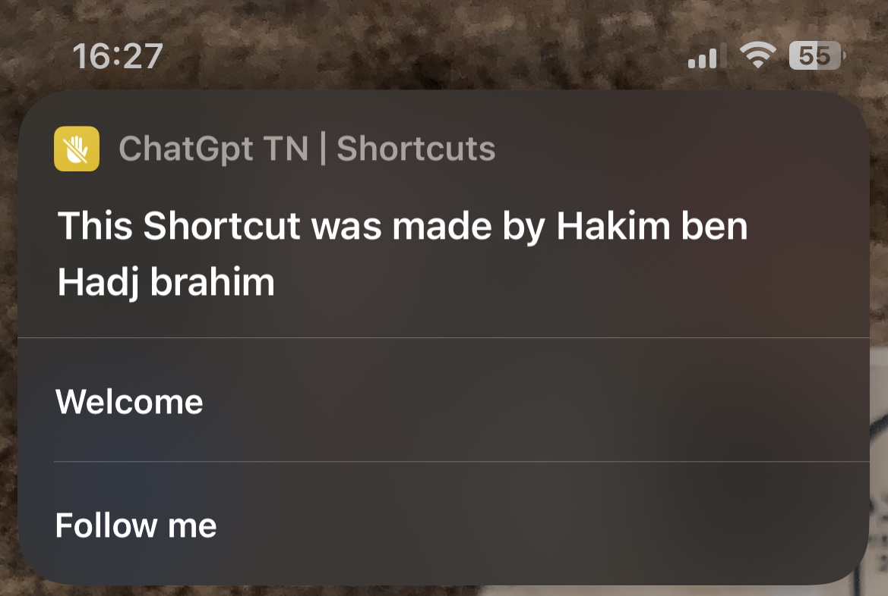
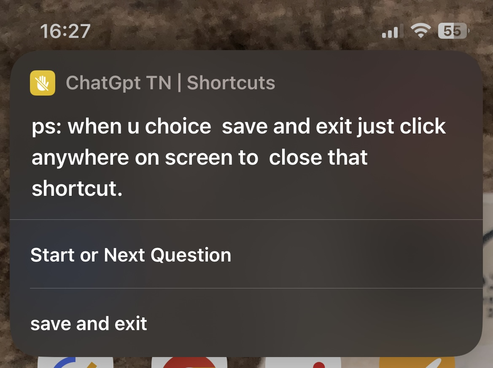
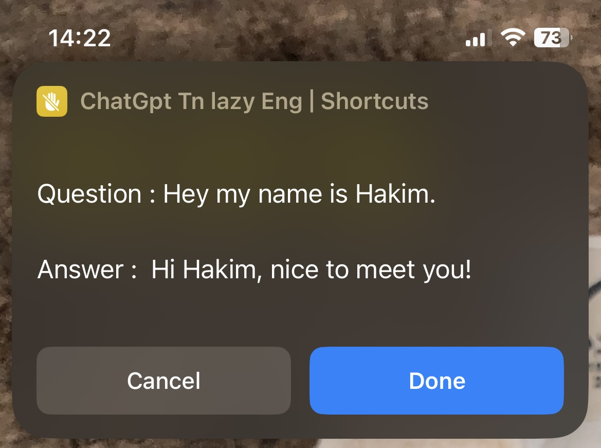
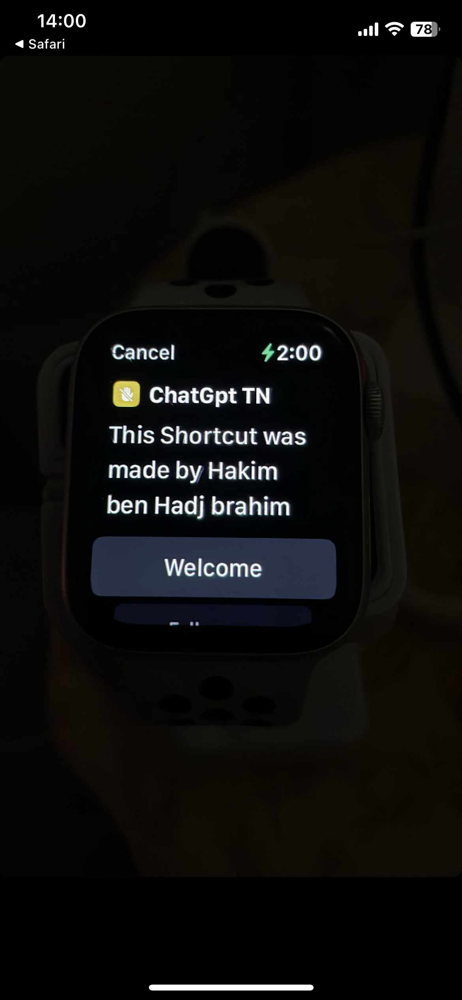
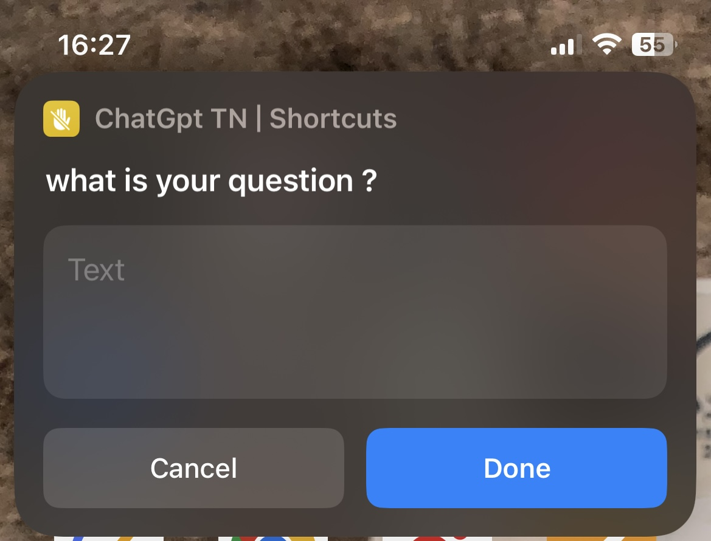

# ChatGPT TN

## Features
- You can start a conversation with AI without logging in or registering.
- This is an unofficial shortchut version implemented by changpt-api, simply put, it is a shared proxy application, and everyone uses the same thread.
- You can ask it to write articles or shopping reviews for you
- More to explore by yourself

## 🚀 About Me
My name is Hakim ben hadj brahim  I am a student in Issat Mateur and I would like to share my project with others who could benefit from it. This project is designed to provide a much-needed service in life, and I am confident it can make a lasting impact. 
## 🔗 Links

## Authors

- [@Hakimbhb](https://www.github.com/hakimbhb)
## ⚙️ Steps:
Step 1: Open https://beta.openai.com/account/api-keys
Step 2: Log in to your account. 
Step 3: Create your own API key and copy it.
Step 4: Open the shortcut and paste in your API key (If this is the first time opening the shortcut, you can paste it directly). 
Step 5: Enjoy and see you soon!

 ## 💡 Informations:

Remember, if you have a free OpenAI account they will provide 18$ of usage over the course of 3 months - after that period is over a credit card must be used to continue using the service. 

## 🚀 Update

## V3
Hello everyone! 

We've decided to make a final change to our shortcut, as the cost associated with using our API has become too much. We are sad to announce that this means we will no longer be using our API in the shortcut, however it is still available for use. To ensure you can continue to use this shortcut, we have added some instructions on how to use your own API instead. 

We'd like to thank you all for understanding and we look forward to working with you all again on more projects in the future. Thank you!

v2
  With this update, we've increased the maximum character limit of your shortcut from 300 to 500 words 
We have improved the display of saved texts to make them more clear and easy to read. 
V3
This upgrade fix for a bug related to saving and exiting ,takes text results from 550 words up to 700 words, making it an even more powerful tool for anyone who wants quick and easy access to bilingual communication and text processing capabilities. 

# Screenshots []
  
  
  
 

 
 
 
 

 
 

## Link to Download
[[https://routinehub.co/shortcut/13951/](https://routinehub.co/shortcut/13951/)](https://routinehub.co/shortcut/13951/)
